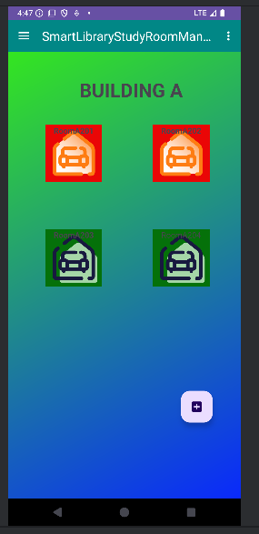
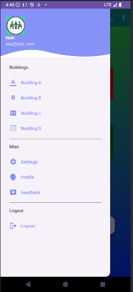
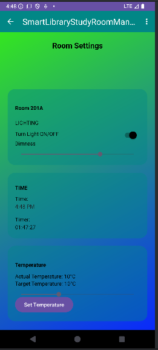
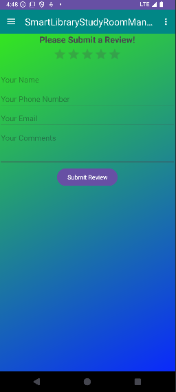

# Smart Library Study Room Management and Comfort System

**Developed by:**
- Mathew Anderson-Saavedra N01436706
- Nicole Chlea Manaoat N01565017
- Medi Muamba Nzambi N01320883
- Safah Virk N01596470
---
 


## **Project Description**

The **Library Room Monitoring and Control System** is an Android-based application that allows students to monitor the availability of walk-in study rooms on campus in real-time. The system uses sensors to track occupancy, room temperature, and air quality to provide students with a comfortable and informed study environment. Students can also control the air conditioning system in each room after authenticating their presence via QR codes or check-in codes.


## 🎯 Features

- 🔍 **Real-Time Room Availability**  
  View live status of study rooms across multiple buildings (occupied or vacant).

- 🌡️ **Environmental Monitoring**  
  Displays room temperature and air quality (supports simulated and real sensor data).

- 🔐 **Secure Room Access**  
  Authenticate using a QR code or unique check-in code to unlock control features.

- 🎛️ **Comfort System Control**  
  Control air conditioning and potentially lighting once authenticated.

- 🏢 **Building-Based Navigation**  
  Organized by campus buildings for intuitive browsing and room selection.

---

## 🛠️ Tech Stack

| Component        | Technology Used                               |
|------------------|------------------------------------------------|
| Frontend (App)   | Java, Android Studio                           |
| Backend          | Firebase Realtime Database, Firebase Auth      |
| Sensor Support   | Designed to support Raspberry Pi, ESP32, etc.  |

---

## 🔌 Sensor Integration (Optional)

Although sensors are currently simulated, the system is designed to support real hardware with minimal adjustments. You can integrate:

- **Motion/IR Sensors** — For real-time occupancy detection  
- **DHT11/DHT22** — For temperature and humidity monitoring  
- **MQ-135** — For air quality measurements  
- **Raspberry Pi / ESP32** — To collect and send data to Firebase  

---

## 🚀 Getting Started

### 📦 Prerequisites

- Android Studio (latest version)
- Java Development Kit (JDK 8 or newer)
- Firebase account with an active project

### 🔧 Setup Instructions

1. **Clone the repository:**
   ```bash
   git clone https://github.com/MathewAnderson6706/Smart-Library-Study-Room-Management-and-Comfort-System.git
   ```

2. **Open the project in Android Studio**  
   Let Gradle sync and resolve dependencies.

3. **Configure Firebase:**
   - Create a Firebase project at [firebase.google.com](https://firebase.google.com)
   - Add an Android app to the project.
   - Download the `google-services.json` file and place it in the `/app` directory.
   - Enable Email/Password Authentication and Realtime Database in the Firebase Console.

4. **Run the App:**
   - Connect an Android device or start an emulator.
   - Build and run the app from Android Studio.

---

## 👥 Intended Users

- 🎓 University students (e.g., University of Toronto)
- 📚 Library visitors and campus guests
- 🧑‍💼 Facility or library administrators

---

## 💡 Future Enhancements

- Push notifications for room availability
- Admin panel for room and building management
- MQTT/WebSocket support for real-time sensor data
- Integration with physical smart locks or HVAC systems

---

## 📸 Screenshots

 
 
 
 
 
---

## 🙋‍♂️ Contact

For feedback or issues, please open a GitHub Issue or submit a Pull Request. Contributions are welcome!
